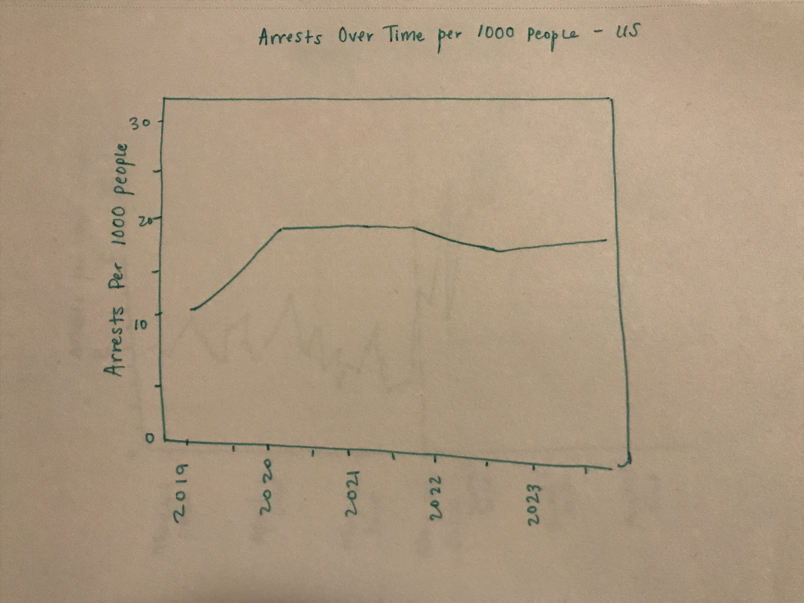
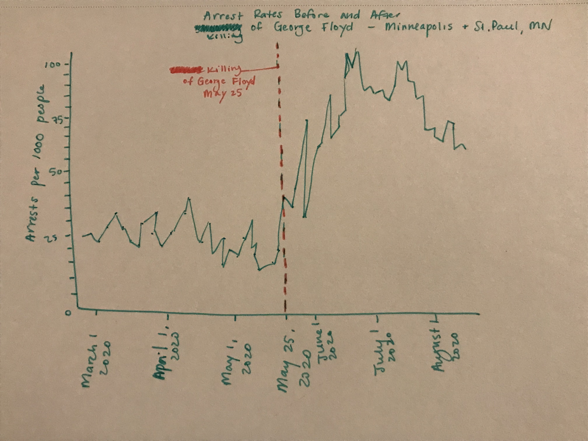
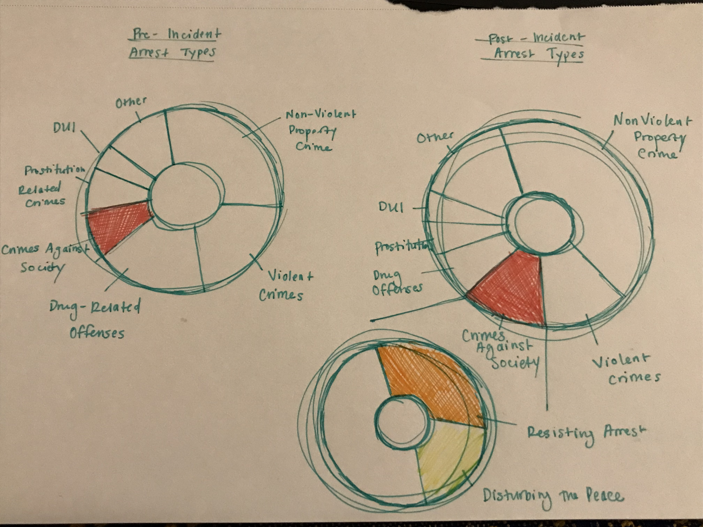
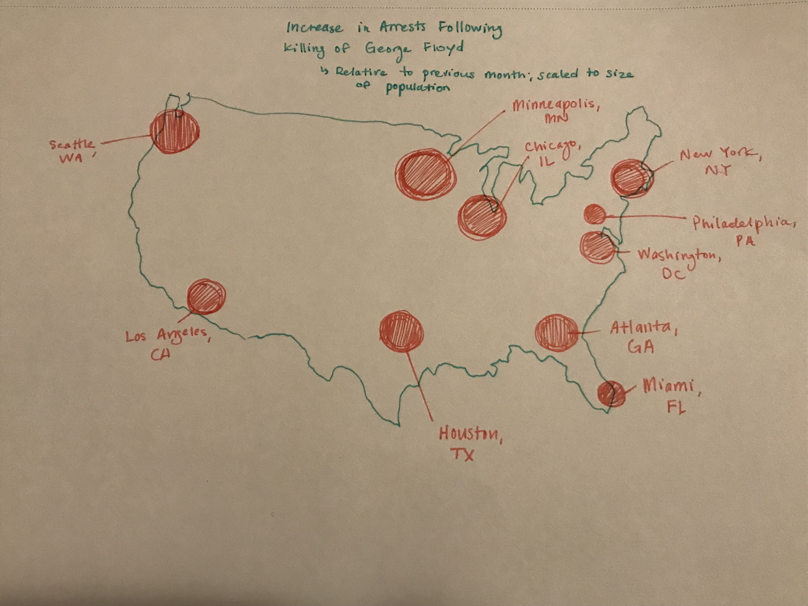
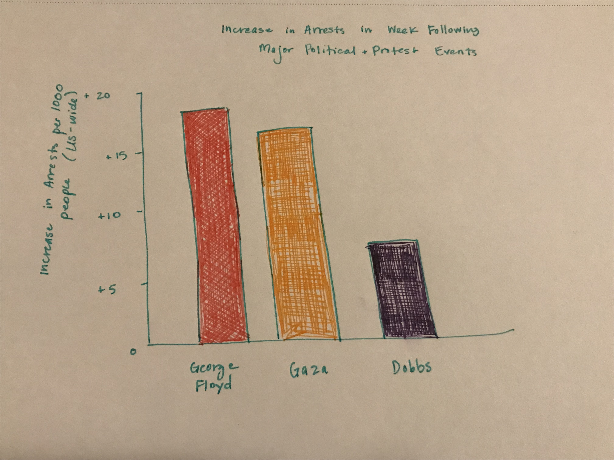

# Outline
In my project, I am interested in exploring the relationship between major US protest movements and policing. Specifically, I am interested to see what trends exist in reasons given for arrests surrounding these protests, and how trends may differ by location and by reason for the protest. Particularly in the past 5 years, there have been major protests in the US surrounding police brutality--including the largest around the 2020 killing of George Floyd by Minneapolis Police Officer Derek Chauvin--as well as during the 2020 election, after the fall of Roe v. Wade, and in response to the October Hamas attack and the ongoing Israeli campaign in Palestine. 

Police interaction with these protestors has been frequent and many protestors have been arrested; the reasons given for arresting protestors vary widely, from disturbing the peace, to vandalism, to resisting arrest, etc. (whether these charges are legitimate or not). I am curious to know if there are specific trends that appear for arrest reasons in the wake of incidents like police shootings or major political developments like Supreme Court decisions. I am also interested in whether and how arrest trends vary depending on location of protests--for example, trends for protests that take place in the same location as the incident (e.g. protests in Minneapolis against the killing of George Floyd, which happened in Minneapolis) vs. satellite protests (e.g., a protest for George Floyd taking place in Baltimore, MD). It is obviously hard to pinpoint which arrests during a given time are directly related to protests vs. part of other unrelated policing activity, but by narrowing focus to specific time periods surrounding known protests I hope to be able to capture this data more precisely.

Without diving into the data analysis and visualization, it is hard to know how the story will play out. However, to illustrate how I may outline and storyboard the data, I can propose a hypothetical flow. 

First, we can look at a broad overview of primary reasons for arrests and how these have changed over time, going back to 2019. Broader arrest trends provide the backdrop for any specific subtrends surrounding protests and any key differences in number of arrests and reasons for arrests surrounding protests. 

We then zoom in to Minneapolis, MN in 2020. We can look at arrest trends the month prior to the killing of George Floyd, from March 2020 to May 2020; then, at the night of May 25 when the incident occurred and time following. Additional photos and/or news stories can provide context here. I anticipate both a surge in arrests the night of and in days following the shooting. 

We can then break down these trends by arrest type or reason for arrest, showing pre-incident trends and post-incident trends surrounding the protests. I would break arrest reasons down into categories to simplify the data, e.g. violent crime vs. property crime vs. "crimes against society," as the FBI Data Explorer terms then, including disturbing the peace. I anticipate the proportion of total arrests made up by each arrest type would differ from pre-incident periods to time periods surrounding incident/protests. If there is one category that increases significantly during protests, I can break apart that category into specific reasons/types of arrest to see which reasons for arrest were potentially driving a large increase in this category during protests (for example, if arrests for property crimes increased dramatically, breaking this apart to see which proportions were made up by theft, vandalism, carjacking, burglary, etc.). 

I can then include some more narrative context from justice organizations like the ACLU on how police interact with protestors, or potentially an anecdote from a protestor who was arrested without cause during the George Floyd protests and the types of charges they faced. I have heard many of these stories anecdotally, but would need to source a news writeup or piece of investigative journalism that could serve as an example here. I hope to use this to provide some context to the numbers, given that an increase in arrests does not always mean an increase in actual crime, and law enforcement may over-police during legitimate protests in efforts to keep the peace and/or suppress public dissent.

Next I would expand out to look at how arrest trends differed for the same protest movement across different US jurisdictions. The shooting of George Floyd happened in Minneapolis, but sparked protests nationwide. I would choose several locations where large satellite protests took place, e.g. Chicago, LA, Seattle, Washington DC, New York, and compare the relative increase in arrests for each of these satellite locations from before the incident to the weeks after. This would involve taking an average arrest number immediately prior to May 25 for each location scaled to population size (e.g. number of arrests per 1000 people), then an average arrest number for each location after the shooting scaled to population size, and finding the difference to find the relative change. This could illustrate whether certain locations saw a greater jump in arrests during the protests, which could lead to questions about policing in those locations and dynamics between police and their constituents.

Finally, I plan to compare the George Floyd protest movement to other recent protest events including demonstrations following the Dobbs v. Jackson Women's Health Organization decision (which overturned Roe v. Wade) and recent protests against Israel's military offensive in Palestine. These all occurred for different types of political events and are likely to have attracted somewhat different (though likely overlapping) protestor demographics. I am curious to see how number of arrests and types of arrests differed for these events, as well as how the demographics of people arrested differed. 

For this comparison, I would like to again compare the relative increase in arrest numbers surrounding each event (aggregated nationwide) in order to see if specific protests have greater increases in arrests. Because George Floyd protests and protests against the invasion of Palestine have been prolonged, I would restrict the time period to within a week of the initial incident (e.g. within a week of May 25, or within a week of October 7, respectively).  I would also like to see how demographic makeup of arrests differ from pre-incident to post-incident for each protest movement--i.e. was there a large increase in arrests of women, or people of a specific race, etc. that differed for the different protests?

Here I can include additional information about disproportionate policing of protestors based on race and gender, as well as historical context of how in the US, policing and threat of arrest/incarceration has been used to deter protestors particularly during movements that threaten the existing status quo. My final call to action will include know-your-rights resources for political protestors, links to organizations that provide bail funds to people detained during peaceful protests, and links to Pittsburgh Protests social media accounts where organizers post local demonstrations students can get involved in as their interest and beliefs dictate.

## Initial sketches

# The data
I plan to primarily use the [FBI's Crime Data Explorer](https://cde.ucr.cjis.gov/LATEST/webapp/#/pages/explorer/crime/arrest) to get information on arrest numbers and resons for arrest from different police jurisdictions across the US at key time periods surrounding major protests. In determining the dates to analyze, I will find information online about specific incidents (e.g. the date of the Dobbs v. Jackson Women's Health Organization decision) and protest dates/times from social media, organizations' websites, event platforms like Eventbrite, and news articles to identify the dates of key marches and other demonstrations. 

# Method and medium
I plan to do the bulk of my data analysis and visualization in Tableau and Tableau Prep. I will then publish the story and visualizations using Shorthand to create a more polished final product. I am still exploring the features of Shorthand and how it integrates with Tableau visualizations but hope to make some of the visualizations interactive to help users engage better with the story.
